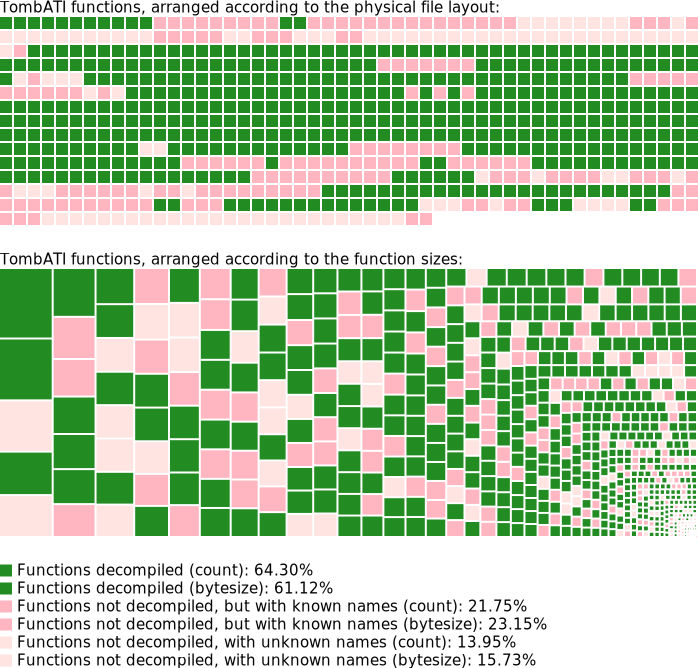

# TR1Main

This is a dynamic library for the classic Tomb Raider I game (TombATI version).
The purpose of the library is to reimplement all the routines performed by the
game and enhance the gameplay with new options.

This project is inspired by Arsunt's
[TR2Main](https://github.com/Arsunt/TR2Main/) project.

## Installing

Get a copy of the latest release from
[here](https://github.com/rr-/TR1Main/releases) and unpack the contents to your
game directory. Make sure you overwrite existing files. Currently TR1Main
requires you to have the TombATI patch installed to work.

## Configuring

To configure TR1Main, edit the `TR1Main.json` file in your text editor such as
Notepad.

Currently the following configuration options are supported:

- `disable_medpacks`: removes all medpacks (for No Meds challenge runs).
- `disable_magnums`: removes all magnum guns and ammo pickups.
- `disable_uzis`: removes all UZI guns and ammo pickups.
- `disable_shotgun`: removes all shotgun and shotgun shells pickups.
- `disable_healing_between_levels`: disables healing Lara between level reloads
  (for No Heal challenge runs).
- `enable_red_healthbar`: replaces the default golden healthbar with a red one.
- `enable_enemy_healthbar`: enables showing healthbar for the active enemy.
- `enable_enhanced_look`: allows the player to look while running, jumping
  etc. (similar to TR2 style).
- `enable_enhanced_ui`: enables UI scaling of in-game inventory text and ammo
  text (useful for 4k screens).
- `enable_numeric_keys`: enables quick weapon draws and medpack usage.
    - <kbd>1</kbd>: draw pistols
    - <kbd>2</kbd>: draw shotgun
    - <kbd>3</kbd>: draw magnums
    - <kbd>4</kbd>: draw UZI
    - <kbd>8</kbd>: use small medpack
    - <kbd>9</kbd>: use large medpack
- `healthbar_showing_mode`: change when the healthbar is displayed. Possible values:
    - `always`: always show the healthbar
    - `flashing`: show the healthbar only when Lara's health is 20% or below
    - `default`: show the healthbar at the beginning of a level, after
      getting hit or while having weapons equipped (as in OG)
- `fix_end_of_level_freeze`: fix game freeze when ending the level with the
  Action key held.
- `fix_tihocan_secret_sound`: disable the secret sound incorrectly playing
  during using the golden key in Tomb of Tihocan.

## Decompilation progress

## License

This project is licensed under the GNU General Public License - see the
[COPYING.md](COPYING.md) file for details.

## Copyright

(c) 2021 Marcin Kurczewski. All rights reserved. Original game is created by
Core Design Ltd. in 1996. Lara Croft and Tomb Raider are trademarks of Square
Enix Ltd.
