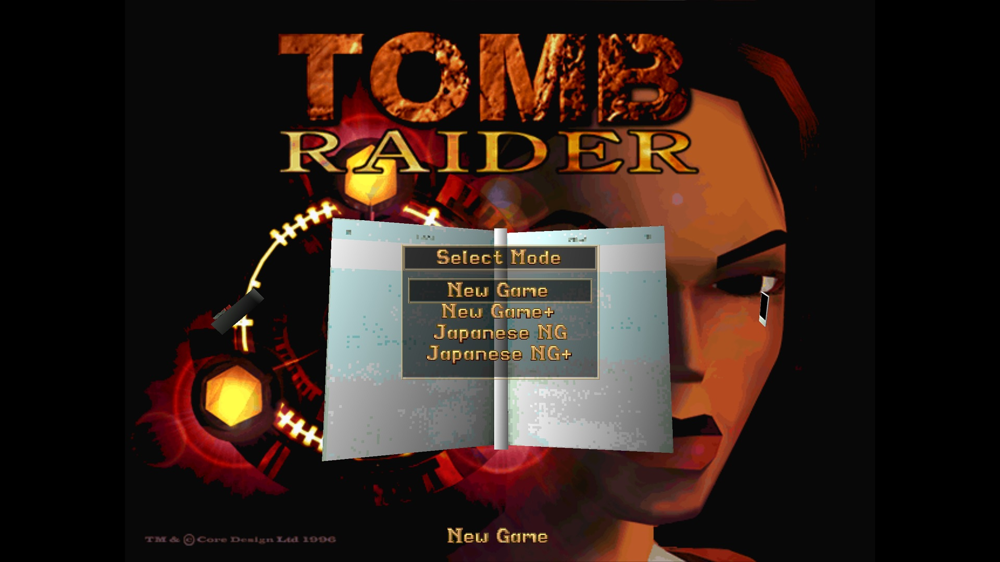
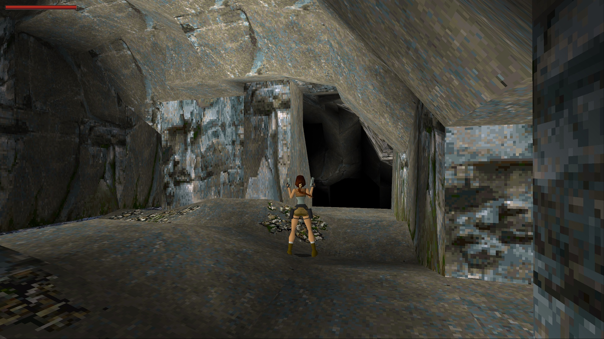
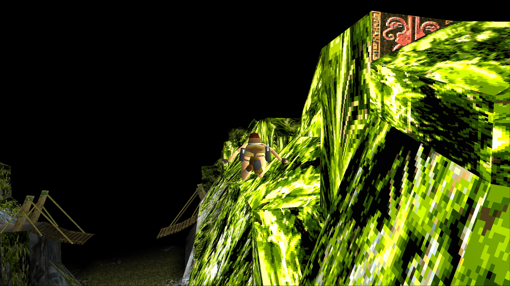
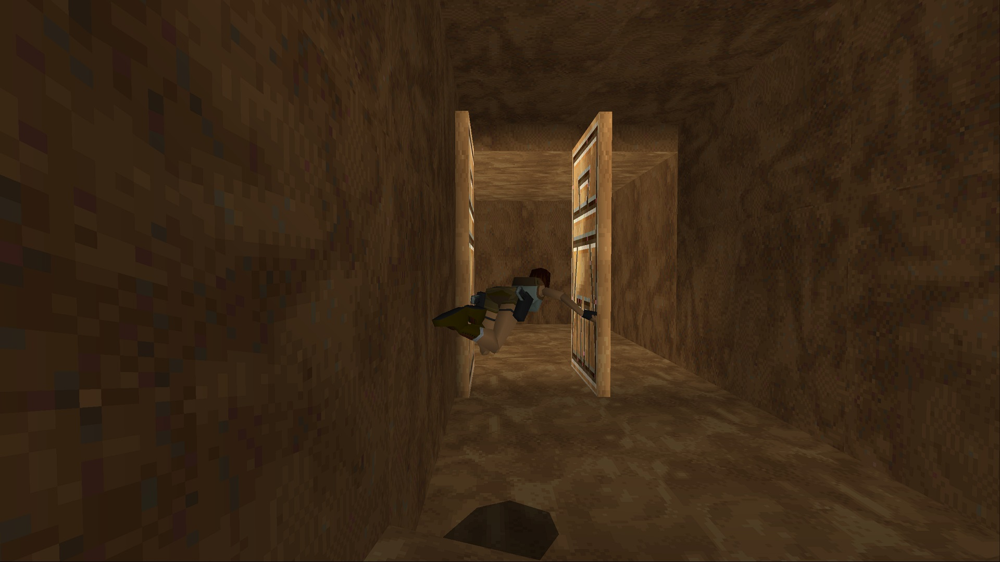
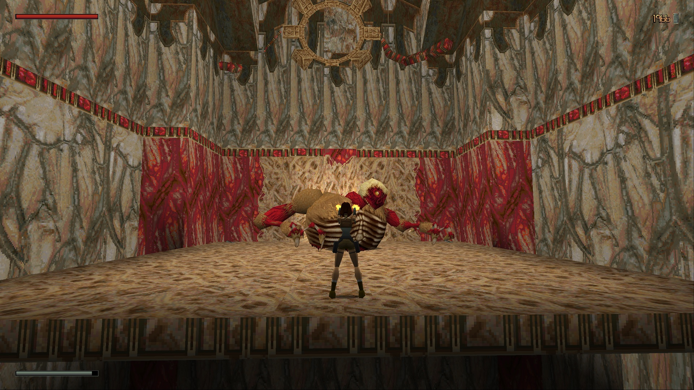

# Tomb Raider I: Community Edition

This is an open source implementation of the classic Tomb Raider I game. It was
made by reverse engineering the TombATI / GLRage variant of the original game
and replacing proprietary audio/video libraries with open source variants.

See the [Tomb Raider Forums
topic](https://www.tombraiderforums.com/showthread.php?p=8286101).

This project was inspired by Arsunt's
[TR2Main](https://github.com/Arsunt/TR2Main/) project and the legacy name,
"Tomb1Main", reflects that.

## Installing

1. Download the latest Tomb1Main release from the GitHub releases.  
   https://github.com/rr-/Tomb1Main/releases

2. Unpack the contents to your game directory.  
   Make sure you choose to overwrite existing directories and files
   (`Tomb1Main_config.json5` can remain).

3. (**Steam users / music**) The Steam version of the game does not ship with the
   music assets due to the publishers' negligence. If you have previously
   installed TombATI, you don't need to do anything. Otherwise you can download
   the music files from the link below.  
   https://mega.nz/file/f9llhQAY#y0RqaMhR4ghtQ-1IFAGbHep_FCmkV8Q66bzdMWVqtuY  
   **These assets are not a part of this project.** The legality of these is
   disputable. The most legal way to get the music on PC is to rip the assets
   yourself from a physical PlayStation disk. TombATI ships with this music by
   default, which this project chooses not to do.

4. Launch `Tomb1Main.exe`.

### Unfinished Business

1. (**Steam users / Unfinished Business**) The Unfinished Business expansion
   pack is freeware, however, the Steam version of the game does not ship with
   it and you'll need to install it separately. If you have previously
   installed TombATI, you don't need to do anything. Otherwise you can download
   the expansion pack from the link below.  
   https://mega.nz/file/i8s0BAaD#wy3xyhuaHnco7aJKiKUV3zO6vCe86lLa3W7hWu249-M

2. Launch the game with `-gold` command line switch. A more detailed instruction:

    1. Create a shortcut to `Tomb1Main.exe`.

    2. Select the newly created shortcut, go to File Properties.

    3. At the end of the "target" field, append `-gold` so it looks something like
        this:  
        `(...)\Tomb1Main.exe -gold`

    4. Launch the shortcut.

If you install everything correctly, your game directory should look more or
less like this (click to expand):

<pre>
.
├── cfg
│   ├── Tomb1Main_gameflow.json5
│   ├── Tomb1Main_gameflow_ub.json5
│   ├── Tomb1Main.json5
├── data
│   ├── cat.phd
│   ├── cred0.pcx
│   ├── cred1.pcx
│   ├── cred2.pcx
│   ├── cred3.pcx
│   ├── cut1.phd
│   ├── cut2.phd
│   ├── cut3.phd
│   ├── cut4.phd
│   ├── egypt.phd
│   ├── eidospc.pcx
│   ├── eidospc.png
│   ├── end2.phd
│   ├── end.pcx
│   ├── end.phd
│   ├── gym.phd
│   ├── install.pcx
│   ├── level10a.phd
│   ├── level10b.phd
│   ├── level10c.phd
│   ├── level1.phd
│   ├── level2.phd
│   ├── level3a.phd
│   ├── level3b.phd
│   ├── level4.phd
│   ├── level5.phd
│   ├── level6.phd
│   ├── level7a.phd
│   ├── level7b.phd
│   ├── level8a.phd
│   ├── level8b.phd
│   ├── level8c.phd
│   ├── titleh.pcx
│   ├── titleh.png
│   ├── titleh_ub.png
│   └── title.phd
├── fmv
│   ├── cafe.rpl
│   ├── canyon.rpl
│   ├── core.avi
│   ├── end.rpl
│   ├── escape.rpl
│   ├── lift.rpl
│   ├── mansion.rpl
│   ├── prison.rpl
│   ├── pyramid.rpl
│   ├── snow.rpl
│   └── vision.rpl
├── music
│   ├── track02.flac
│   ├── track03.flac
│   ├── track04.flac
│   ├── track05.flac
│   ├── track06.flac
│   ├── track07.flac
│   ├── track08.flac
│   ├── track09.flac
│   ├── track10.flac
│   ├── track11.flac
│   ├── track12.flac
│   ├── track13.flac
│   ├── track14.flac
│   ├── track15.flac
│   ├── track16.flac
│   ├── track17.flac
│   ├── track18.flac
│   ├── track19.flac
│   ├── track20.flac
│   ├── track21.flac
│   ├── track22.flac
│   ├── track23.flac
│   ├── track24.flac
│   ├── track25.flac
│   ├── track26.flac
│   ├── track27.flac
│   ├── track28.flac
│   ├── track29.flac
│   ├── track30.flac
│   ├── track31.flac
│   ├── track32.flac
│   ├── track33.flac
│   ├── track34.flac
│   ├── track35.flac
│   ├── track36.flac
│   ├── track37.flac
│   ├── track38.flac
│   ├── track39.flac
│   ├── track40.flac
│   ├── track41.flac
│   ├── track42.flac
│   ├── track43.flac
│   ├── track44.flac
│   ├── track45.flac
│   ├── track46.flac
│   ├── track47.flac
│   ├── track48.flac
│   ├── track49.flac
│   ├── track50.flac
│   ├── track51.flac
│   ├── track52.flac
│   ├── track53.flac
│   ├── track54.flac
│   ├── track55.flac
│   ├── track56.flac
│   ├── track57.flac
│   ├── track58.flac
│   ├── track59.flac
│   └── track60.flac
├── shaders
│   ├── 2d.fsh
│   ├── 2d.vsh
│   ├── 3d.fsh
│   └── 3d.vsh
├── Tomb1Main.exe
</pre>

## Configuring

To configure Tomb1Main, edit the `Tomb1Main.json5` file in your text editor
such as Notepad. All the configuration is explained in that file.

## Improvements over original game

Not all options are turned on by default. Refer to `Tomb1Main.json5` for details.

- added proper UI and bar scaling
- added enemy health bar
- added deaths counter
- added more control over when to show health bar and air bar
- added customizability to health bar and air bar
- added ability to set user-defined FOV
- added ability to select weapons / using items with numeric keys
- added ability to look around while running
- added TR3-like sidesteps
- added shotgun flash sprites
- added a fly cheat
- added a level skip cheat
- added a door open cheat (while in fly mode)
- added a cheat to increase the game speed
- added ability to adjust Lara's starting health
- added ability to disable all medpacks
- added ability to disable Magnums
- added ability to disable UZIs
- added ability to disable shotgun
- added ability to disable main menu demos
- added ability to disable FMVs
- added ability to disable cutscenes
- added ability to disable healing between levels
- added rendering of pickups on the ground as 3D meshes
- added ability to automatically walk to items when nearby
- added braid (currently only works in Lost Valley)
- added support for displaying more than 3 pickup sprites
- added a choice whether to play NG or NG+
- added Japanese mode (guns deal twice the damage); available for both NG and NG+
- added external game flow (no longer 2 different .exes for TR1 and TR1UB). For TRLE builders:
    - the levels can be reordered
    - the levels can be renamed
    - all the strings can be translated, including keys and items
    - you no longer are constrained to 4 or 21 levels only
    - you can offer a custom Gym level
    - you can change the main menu backdrop
- added automatic calculation of secret numbers
- added compass level stats
- added ability to keep timer on in inventory
- added save game crystals game mode (enabled via gameflow)
- added pause screen
- added movable camera on W,A,S,D
- added controller support
    | Xbox button | DualShock button   | Action          |
    | ----------- | ------------------ | --------------- |
    | Left Stick  | Left stick         | Movement        |
    | A           | X                  | Action/select   |
    | B           | Circle             | Roll/deselect   |
    | X           | Square             | Jump            |
    | Y           | Triangle           | Draw weapons    |
    | LB          | L1                 | Look            |
    | RB          | R1                 | Walk            |
    | LT          | L2                 | Sidestep left   |
    | RT          | R2                 | Sidestep right  |
    | D-pad       | D-pad              | Movement        |
    | Back        | Share/Touchpad     | Inventory       |
    | Start       | Options            | Pause           |
    | Right Stick | Right stick        | Camera movement |
    | R3          | R3                 | Reset camera    |
- added rounded shadows (instead of the default octagon)
- added per-level customizable water color (with customizable blue component)
- added per-level customizable fog distance
- added adjustable in-game brightness
- added .jpeg/.png screenshots
- added support for HD FMVs
- added fanmade 16:9 menu backgrounds
- added ability to skip FMVs with the Action key
- added fade effects
- added a vsync option
- added total pickups and kills per level to the stats screen
- added restart level to passport menu on death
- added contextual arrows to menu options
- added a final statistics screen
- added music during the credits
- added fade effects to displayed images
- added unobtainable pickups and kills stats support in the gameflow
- added the option to pause sound in the inventory screen
- added level selection to the load game menu
- added the ability to make freshly triggered (runaway) Pierre replace an already existing (runaway) Pierre
- added the PS1 style UI
- changed internal game memory limit from 3.5 MB to 16 MB
- changed moveable limit from 256 to 10240
- changed maximum textures from 2048 to 8192
- changed maximum texture pages from 32 to 128
- changed input method to DirectInput
- changed saves to be put in the saves/ directory
- fixed inability to switch Control keys during shimmy
- fixed skipping FMVs triggering inventory
- fixed skipping credits working too fast
- fixed setting user keys being very difficult
- fixed keys and items not working when drawing guns immediately after using them
- fixed not being able to close level stats with Escape
- fixed freeze when holding action key during end of level
- fixed reading user settings not restoring the volume
- fixed Tomb of Tihocan playing secret sound
- fixed The Great Pyramid secret
- fixed running out of ammo forcing Lara to equip pistols even if she doesn't carry them
- fixed a crash when Lara is on fire and goes too far away from where she caught fire
- fixed settings not being saved when exiting the game with Alt+F4
- fixed settings not persisting chosen layout (default vs. user keys)
- fixed the sound of collecting a secret killing the music
- fixed the infamous Tihocan crocodile bug (integer overflow causing creatures to deal damage across the entire level)
- fixed Lara jumping forever when alt+tabbing out of the game
- fixed Lara voiding if a badly placed timed door closes on her (doesn't occur in OG levels)
- fixed bats being positioned too high
- fixed Lara not being able to grab parts of some bridges
- fixed alligators dealing no damage if Lara remains still in the water
- fixed shotgun shooting when a locked target moves out of Lara's sight
- fixed shotgun shooting too fast when not aiming at a target
- fixed Lara grabbing ledges she shouldn't in stacked rooms (mainly St. Francis Folly tower)
- fixed rare cases of Lara getting set on fire on a bridge over lava
- fixed saving the game near Bacon Lara breaking her movement
- fixed thin black lines between polygons
- fixed audio mixer stopping playing sounds on big explosions
- fixed underwater ambient sound effect not playing
- fixed Lara glitching through static objects into a black void
- fixed black screen flashing when navigating the inventory
- fixed Lara pushing blocks through doors
- fixed game audio not muting when game is minimized
- fixed Lara switching to pistols when completing a level with other guns
- fixed detail levels text flashing with any option change
- fixed empty mutant shells in Unfinished Business spawning Lara's hips
- fixed gun pickups disappearing in rare circumstances on save load (#406)
- fixed broken dart ricochet effect
- fixed exploded mutant pods sometimes appearing unhatched on reload
- fixed sound effects playing rapidly in sound menu if input held down
- fixed underwater caustics animating at 2x speed
- fixed bridges at floor level appearing under the floor

## Showcase

#### Mode selection

#### Braid

#### Fly cheat

#### Door open cheat

#### Enemy health bars

## Q&A

1. **Is the game fully playable from beginning to the end?**

    Yes. If you encounter a bug, please file a ticket.

2. **Can we get HD textures? Reflections? Other graphical updates?**

    Eventually, probably yes. Please see the road map to have a general idea
    what is currently being worked on.

3. **Can we get braid in every level? Skyboxes? Flyby cameras? New animations? etc.**

    Not sure at this moment; this requires meddling with the original game
    level files. It's one thing fixing a faulty trigger bit in The Great
    Pyramid for the final secret, and another to insert a completely new
    animation, a textured mesh or a sound file and pretend it's always been a
    part of the original game. So far we haven't found a good way that'll keep
    the code maintainable.

4. **Can I play this on Mac, Linux, Android...?**

    No promises here, but the game is now playable with wine (including sound
    and music) and there is planned work towards reducing the amount of
    Windows-only code.

## Current road map

Note: this section may be subject to change.

- [x] Reverse engineer the main game module
- [x] Integrate the glrage patch
- [x] Replace the proprietary music player with libavcodec and SDL
- [x] Replace the proprietary FMV player with libavcodec and SDL
- [x] Break off TombATI, ship our own .EXE rather than a .DLL
- [ ] Work on cross platform builds
    - [x] Port DirectSound to libavcodec and SDL
    - [x] Port WinMM to libavcodec and SDL
    - [x] Port DirectInput to SDL
    - [ ] Replace wgl_ext.h with cross platform variant
    - [ ] Remove HWND and HINSTANCE usages
    - [ ] ...
    - [ ] Test for performance and crash resilience
    - [ ] 3.0
- [ ] Beautify the code
    - [x] Refactor GLRage to no longer emulate DDraw
    - [x] Refactor GLRage to no longer emulate ATI3DCIF
    - [x] Apply rigid name conventions to function names
    - [ ] Refactor specific/ away?
    - [ ] ...
- [ ] Work on data injection and other features?

## Importing data to IDA

This option requires IDAPython and a recent version of IDA. Install Python 3.8+
and IDA 7.5+, then hit alt+f7, then choose `tools/ida_import.py`.

## License

This project is licensed under the GNU General Public License - see the
[COPYING.md](COPYING.md) file for details.

## Copyright

(c) 2021 Marcin Kurczewski. All rights reserved. Original game is created by
Core Design Ltd. in 1996. Lara Croft and Tomb Raider are trademarks of Square
Enix Ltd. Title image by Kidd Bowyer.
