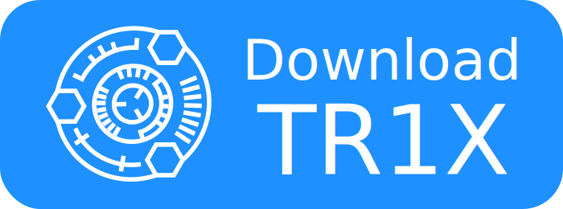
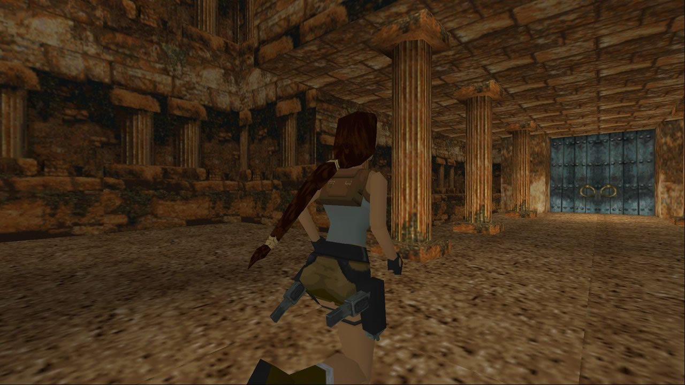
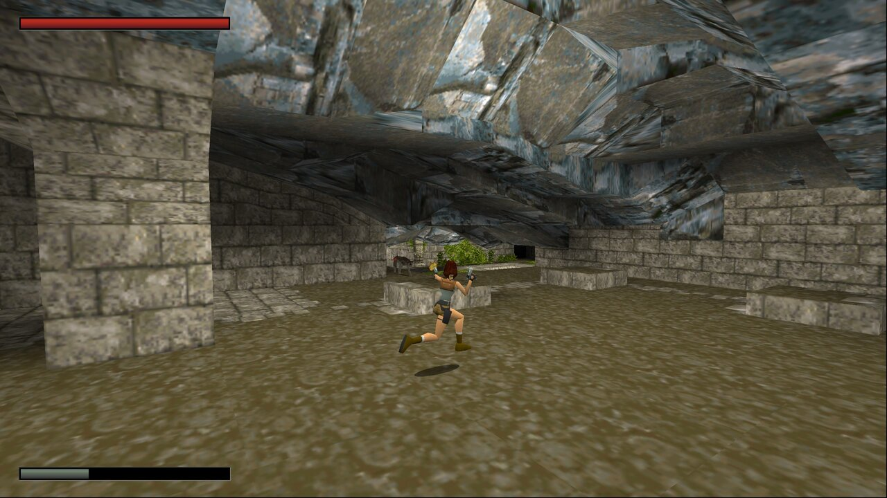
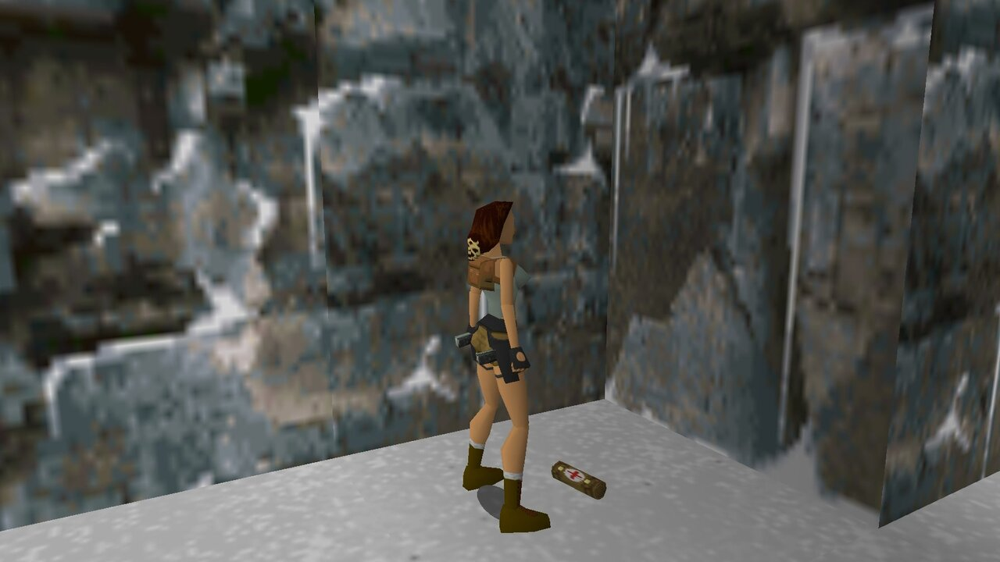
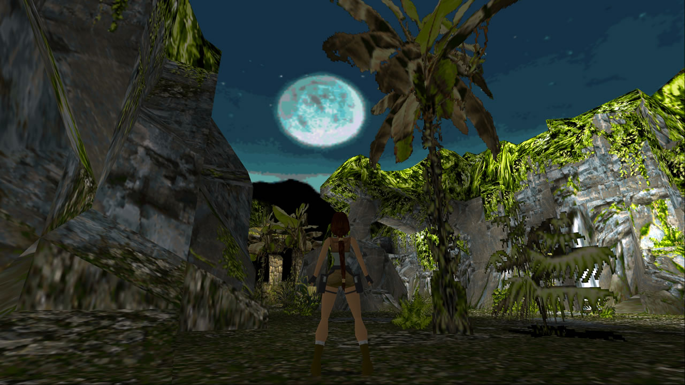
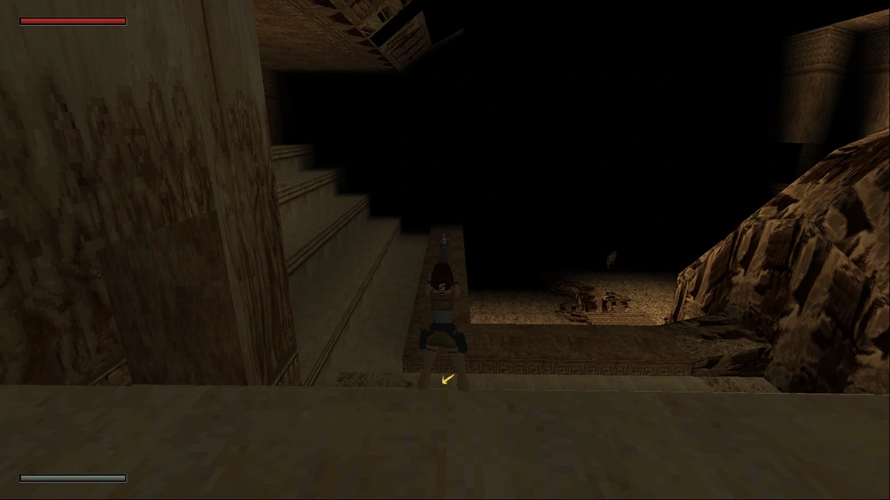
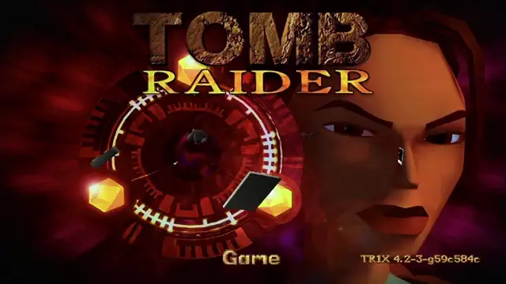
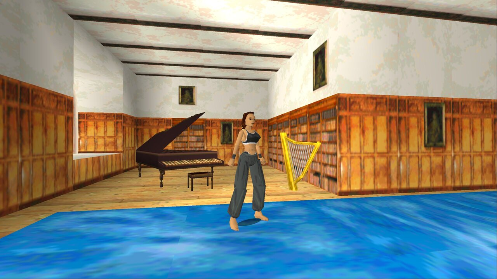
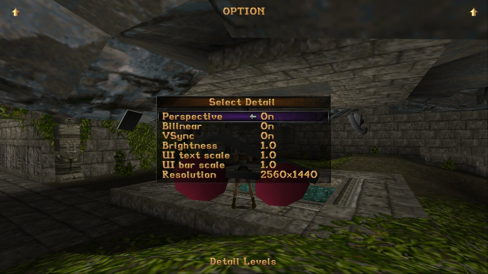

<h1>TRX – Tomb Raider I & II: Community Edition</h1>

> [!NOTE]
>
> We've merged TR1X and TR2X into a single codebase, now renamed **TRX**.
>
> - TR1 and TR2 remain distinct with their own release cycles.
> - Config tools and TR1 installer remain separate.
> - Simplifies internal code merges and feature sharing, replacing **libtrx**.
>
> Thanks for your support!

Welcome to **TRX** – an open-source reimplementation of **Tomb Raider 1** and **Tomb Raider 2**, respectively. Both projects aim to enhance these classic games through decompilation and the implementation of open-source alternatives to proprietary components.

## TR1X - Tomb Raider 1
### Showcase
<table>
    <tr>
        <th>
            Restored braid
            
        </th>
        <th>
            Enemy health bar and UI scaling
            
        </th>
    </tr>
    <tr>
        <th>
            3D pickups
            
        </th>
        <th>
            Skybox support
            
        </th>
    </tr>
    <tr>
        <th>
            Customizable draw distance
            
        </th>
        <th>
            Developer console
            
        </th>
    </tr>
    <tr>
        <th>
            Free camera
            
        </th>
        <th>
            PS1 UI and new graphics options
            
        </th>
    </tr>
</table>

### Download
Download the latest release:

See [the changelog](docs/tr1/CHANGELOG.md).

### Install Instructions
Please refer to the [detailed documentation](docs/tr1/).

## TR2X - Tomb Raider 2

### Overview
TR2X serves as a sequel to TR1X, currently focusing on the decompilation of Tomb Raider 2.

### Decompilation Progress

### Download
Download the latest release:

See [the changelog](docs/tr2/CHANGELOG.md).

### Install Instructions
Please refer to the [detailed documentation](docs/tr2/).

## Q&A

1. **Is the game fully playable from beginning to the end?**

    By all means! If you encounter a bug, please file a ticket.

2. **Can we get HD textures? Reflections? Other visual updates?**

    We hope so! Being able to introduce skyboxes to TR1 showed that quite
    literally sky is the limit. But great stuff takes time.

4. **Can I play this on Mac, Linux, Android...?**

    Currently supported platforms include Windows, Linux and macOS for TR1X,
    and Windows for TR2X.

5. **What's the relation to TR2Main?**

    Originally founded as TR1Main in 2021, our project flourished independently
    without sharing the code, with the shared brand concept existing only as an
    idea. To better represent this, we rebranded to Tomb1Main. In 2023, we
    further refined our identity by adopting the name TR1X. Meanwhile, TR2Main
    follows a completely separate and unique path, unconnected to our
    development work.
