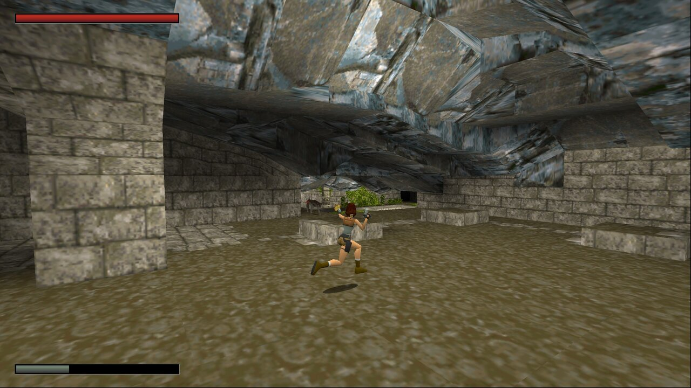
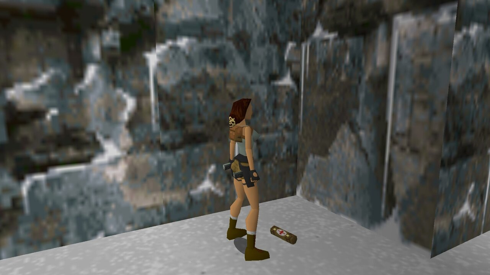
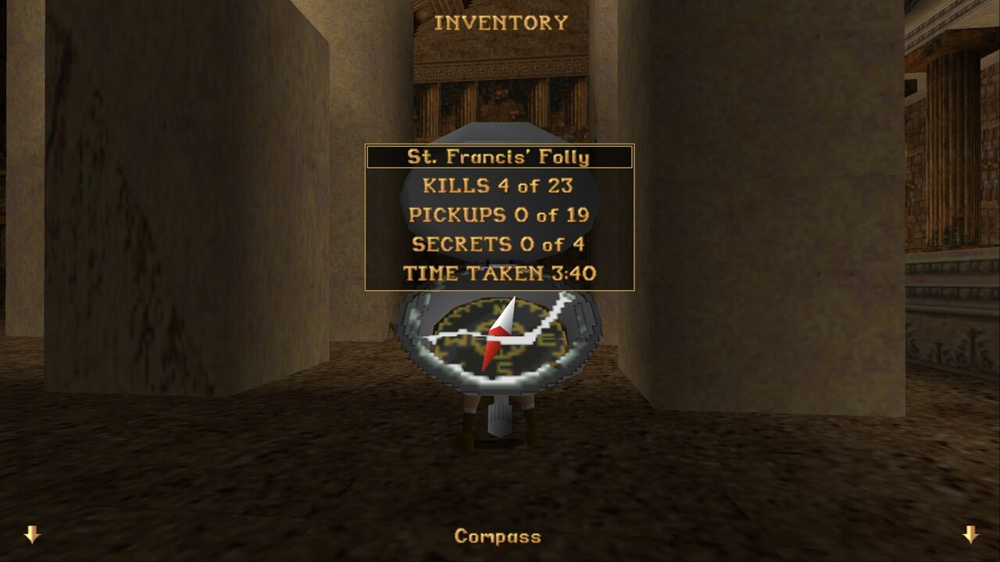
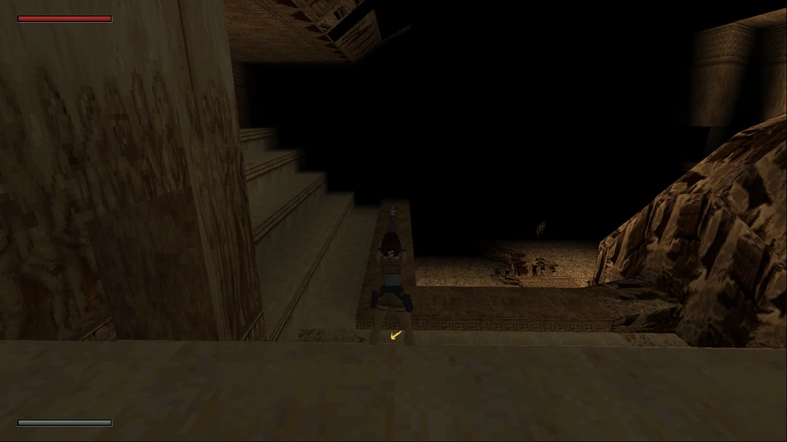
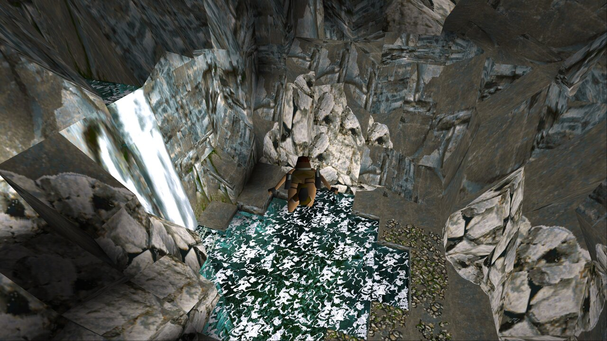
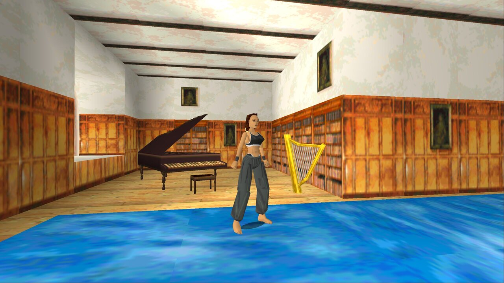
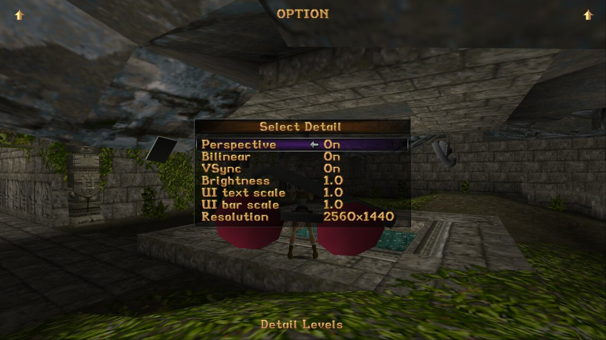

# Tomb Raider I: Community Edition

This is an open source implementation of the classic Tomb Raider I game (1996),
made by reverse engineering the TombATI / GLRage variant of the original game
and replacing proprietary audio/video libraries with open source variants.

See the [Tomb Raider Forums
topic](https://www.tombraiderforums.com/showthread.php?p=8286101).

This project was inspired by Arsunt's
[TR2Main](https://github.com/Arsunt/TR2Main/) project and the legacy name,
"Tomb1Main", reflects that.

## Showcase

<table>
    <tr>
        <th>
            Enemy health bar and UI scaling
            
        </th>
        <th>
            3D pickups
            
        </th>
    </tr>
    <tr>
        <th>
            Improved stats
            
        </th>
        <th>
            Customizable draw distance
            
        </th>
    </tr>
    <tr>
        <th>
            Fly cheat
            
        </th>
        <th>
            Free camera
            
        </th>
    </tr>
    <tr>
        <th>
            PS1 UI and new graphics options
            
        </th>
    </tr>
</table>

## Installing (simplified)

1. Head over to GitHub releases: https://github.com/rr-/Tomb1Main/releases
2. Download the installer. Your browser may complain that the .exe is unsafe, but it's OK to ignore this alert.
3. Mark the installer EXE as safe to run by right-clicking on the .exe, going to properties and clicking "Unblock".
4. Run the installer and proceed with the steps.

We hope that eventually these alerts will go away as the popularity of the project rises.

## Installing (advanced / manual)

1. Head over to GitHub releases: https://github.com/rr-/Tomb1Main/releases
2. Download the zip file.
3. Extract the zip file into a directory of your choice.  
   Make sure you choose to overwrite existing directories and files
   (`cfg/Tomb1Main_config.json5` can remain, but new features will not be configurable).
4. (First time installation) Put your original game files into the target directory.
    1. For Steam and GOG users, extract the original `GAME.BIN` file using a tool such as UltraISO to your target directory.
       Note that neither the GOG nor the Steam releases ship the music files. You have a few options here:
       - You can download the music files from the link below.  
         https://tmp.sakuya.pl/tomb1main/music.zip
         The legality of this approach is disputable.
       - Rip the assets yourself from a physical PlayStation/SegaSaturn disk.

       Optionally you can also install the Unfinished Business expansion pack files.
       - Either this variant: https://tmp.sakuya.pl/tomb1main/unfinished_business.zip
       - Or the more manual link: https://archive.org/details/tomb-raider-i-unfinished-business-pc-eng-full-version_20201225
   2. For TombATI users this means copying the `data`, `fmv` and `music` directories.
5. To play the game, run `Tomb1Main.exe`.
6. To play the Unfinished Expansion pack, run `Tomb1Main.exe -gold`.

If you install everything correctly, your game directory should look more or
less like this (click to expand):

<em>* Will not be present until the game has been launched.</em>

<pre>
.
├── cfg
│   ├── Tomb1Main_gameflow.json5
│   ├── Tomb1Main_gameflow_ub.json5
│   ├── Tomb1Main.json5 *
├── data
│   ├── cat.phd
│   ├── cred0.pcx
│   ├── cred1.pcx
│   ├── cred2.pcx
│   ├── cred3.pcx
│   ├── cut1.phd
│   ├── cut2.phd
│   ├── cut3.phd
│   ├── cut4.phd
│   ├── egypt.phd
│   ├── eidospc.pcx
│   ├── eidospc.png
│   ├── end2.phd
│   ├── end.pcx
│   ├── end.phd
│   ├── gym.phd
│   ├── install.pcx
│   ├── level10a.phd
│   ├── level10b.phd
│   ├── level10c.phd
│   ├── level1.phd
│   ├── level2.phd
│   ├── level3a.phd
│   ├── level3b.phd
│   ├── level4.phd
│   ├── level5.phd
│   ├── level6.phd
│   ├── level7a.phd
│   ├── level7b.phd
│   ├── level8a.phd
│   ├── level8b.phd
│   ├── level8c.phd
│   ├── titleh.pcx
│   ├── titleh.png
│   ├── titleh_ub.png
│   └── title.phd
├── fmv
│   ├── cafe.rpl
│   ├── canyon.rpl
│   ├── core.avi
│   ├── end.rpl
│   ├── escape.rpl
│   ├── lift.rpl
│   ├── mansion.rpl
│   ├── prison.rpl
│   ├── pyramid.rpl
│   ├── snow.rpl
│   └── vision.rpl
├── music
│   ├── track02.flac
│   ├── track03.flac
│   ├── track04.flac
│   ├── track05.flac
│   ├── track06.flac
│   ├── track07.flac
│   ├── track08.flac
│   ├── track09.flac
│   ├── track10.flac
│   ├── track11.flac
│   ├── track12.flac
│   ├── track13.flac
│   ├── track14.flac
│   ├── track15.flac
│   ├── track16.flac
│   ├── track17.flac
│   ├── track18.flac
│   ├── track19.flac
│   ├── track20.flac
│   ├── track21.flac
│   ├── track22.flac
│   ├── track23.flac
│   ├── track24.flac
│   ├── track25.flac
│   ├── track26.flac
│   ├── track27.flac
│   ├── track28.flac
│   ├── track29.flac
│   ├── track30.flac
│   ├── track31.flac
│   ├── track32.flac
│   ├── track33.flac
│   ├── track34.flac
│   ├── track35.flac
│   ├── track36.flac
│   ├── track37.flac
│   ├── track38.flac
│   ├── track39.flac
│   ├── track40.flac
│   ├── track41.flac
│   ├── track42.flac
│   ├── track43.flac
│   ├── track44.flac
│   ├── track45.flac
│   ├── track46.flac
│   ├── track47.flac
│   ├── track48.flac
│   ├── track49.flac
│   ├── track50.flac
│   ├── track51.flac
│   ├── track52.flac
│   ├── track53.flac
│   ├── track54.flac
│   ├── track55.flac
│   ├── track56.flac
│   ├── track57.flac
│   ├── track58.flac
│   ├── track59.flac
│   └── track60.flac
├── shaders
│   ├── 2d.fsh
│   ├── 2d.vsh
│   ├── 3d.fsh
│   └── 3d.vsh
├── Tomb1Main.exe
├── Tomb1Main_ConfigTool.exe
</pre>

## Configuring

To configure Tomb1Main, run the `Tomb1Main_ConfigTool.exe` application. All the
configuration is explained in this tool. Alternatively, after running the game
at least once, you can edit `Tomb1Main.json5` manually in a text editor such
as Notepad.

## Improvements over original game

Not all options are turned on by default. Refer to `Tomb1Main_ConfigTool.exe` for details.

#### UI
- added proper UI and bar scaling
- added enemy health bars
- added PS1 style UI
- added fade effects to displayed images

#### Gameplay
- added ability to set user-defined FOV
- added ability to select weapons / using items with numeric keys
- added ability to look around while running
- added ability to sidestep like in TR3
- added ability to automatically walk to items when nearby
- added a pause screen
- added a choice whether to play NG or NG+ without having to play the entire game
- added Japanese mode (guns deal twice the damage, inspired by JP release of TR3); available for both NG and NG+
- added ability to restart level on death
- added ability to restart the adventure from any level when loading a game
- added the "Story so far..." option in the select level menu to view cutscenes and FMVs
- added graphics effects, lava emitters, flame emitters, and waterfalls to the savegame so they now persist on load
- fixed keys and items not working when drawing guns immediately after using them
- fixed counting the secret in The Great Pyramid
- fixed running out of ammo forcing Lara to equip pistols even if she doesn't carry them
- fixed a crash when Lara is on fire and goes too far away from where she caught fire
- fixed settings not being saved when exiting the game with Alt+F4
- fixed settings not persisting chosen layout (default vs. user keys)
- fixed the infamous Tihocan crocodile bug (integer overflow causing creatures to deal damage across the entire level)
- fixed Lara not being able to grab parts of some bridges
- fixed Lara voiding if a badly placed timed door closes on her (doesn't occur in OG levels)
- fixed bats being positioned too high
- fixed alligators dealing no damage if Lara remains still in the water
- fixed shotgun shooting when a locked target moves out of Lara's sight
- fixed shotgun shooting too fast when not aiming at a target
- fixed Lara grabbing ledges she shouldn't in stacked rooms (mainly St. Francis Folly tower)
- fixed rare cases of Lara getting set on fire on a bridge over lava
- fixed saving the game near Bacon Lara breaking her movement
- fixed Lara glitching through static objects into a black void
- fixed Lara pushing blocks through doors
- fixed Lara switching to pistols when completing a level with other guns
- fixed empty mutant shells in Unfinished Business spawning Lara's hips
- fixed gun pickups disappearing in rare circumstances on save load (#406)
- fixed broken dart ricochet effect
- fixed exploded mutant pods sometimes appearing unhatched on reload
- fixed bridges at floor level appearing under the floor
- fixed underwater currents breaking in rare cases
- fixed Lara loading inside a movable block if she's on a stack near a room portal
- fixed a game crash on shutdown if the action button is held down
- fixed Scion 1 respawning on load
- fixed triggered flip effects not working if there are no sound devices

#### Cheats
- added a fly cheat
- added a level skip cheat
- added a door open cheat (while in fly mode)
- added a cheat to increase the game speed

#### Input
- added ability to move camera around with W,A,S,D
- added additional custom control schemes
- added the ability to unbind unessential keys
- added the ability to reset control schemes to default
- added customizable controller support
- fixed freeze when holding the Action key during end of level
- fixed inability to switch Control keys when shimmying
- fixed setting user keys being very difficult
- fixed skipping FMVs triggering inventory
- fixed skipping credits working too fast
- fixed not being able to close level stats with Escape
- fixed Lara jumping forever when alt+tabbing out of the game
- stopped the default controls from functioning when the user unbound them

#### Statistics
- added ability to keep timer on in inventory
- added optional compass level stats
- added optional final statistics screen
- added optional deaths counter
- added optional total pickups and kills per level
- added unobtainable pickups and kills stats support in the gameflow

#### Visuals
- added optional shotgun flash sprites
- added optional rendering of pickups on the ground as 3D meshes
- added Lara's braid to each level
- added support for displaying more than 3 pickup sprites
- added more control over when to show health bar and air bar
- added customizable health bar and air bar
- added rounded shadows (instead of the default octagon)
- added adjustable in-game brightness
- added support for HD FMVs
- added fanmade 16:9 menu backgrounds
- added optional fade effects
- added a vsync option
- added contextual arrows to menu options
- fixed thin black lines between polygons
- fixed black screen flashing when navigating the inventory
- fixed detail levels text flashing with any option change
- fixed underwater caustics animating at 2x speed
- fixed incorrect ceiling textures in Colosseum 
- fixed inconsistencies in some enemy textures

#### Audio
- added music during the credits
- added an option to turn off sound effect pitching
- added an option to use the PlayStation Uzi sound effects
- fixed the sound of collecting a secret killing the music
- fixed audio mixer stopping playing sounds on big explosions
- fixed game audio not muting when game is minimized
- fixed underwater ambient sound effect not playing
- fixed sound effects playing rapidly in sound menu if input held down

#### Mods
- added ability to adjust Lara's starting health (easy no damage mod)
- added ability to disable healing between levels
- added ability to disable certain item pickups (all medpacks, shotgun, Magnums and/or UZIs)
- added ability to disable main menu demos, FMVs and/or cutscenes
- added external game flow (no longer 2 different .exes for TR1 and TR1UB). For TRLE builders:
    - the levels can be reordered
    - the levels can be renamed
    - all the strings can be translated, including keys and items
    - you no longer are constrained to 4 or 21 levels only
    - you can offer a custom Gym level
    - you can change the main menu backdrop
- added automatic calculation of secret counts (no longer having to fiddle with the .exe to get correct secret stats)
- added save game crystals game mode (enabled via gameflow)
- added per-level customizable water color (with customizable blue component)
- added per-level customizable fog distance

#### Miscellaneous
- added .jpeg/.png screenshots
- added an option to pause sound in the inventory screen
- added ability to skip FMVs with the Action key
- added ability to make freshly triggered (runaway) Pierre replace an already existing (runaway) Pierre
- expanded internal game memory limit from 3.5 MB to 16 MB
- expanded moveable limit from 256 to 10240
- expanded maximum textures from 2048 to 8192
- expanded maximum texture pages from 32 to 128
- ported audio decoding library to ffmpeg
- ported video decoding library to ffmpeg
- ported image decoding library to ffmpeg
- ported audio output library to SDL
- ported input method to SDL
- changed saves to be put in the saves/ directory
- fixed playing the secret sound in Tomb of Tihocan
- fixed reading user settings not restoring the volume

## Q&A

1. **Is the game fully playable from beginning to the end?**

    Yes. If you encounter a bug, please file a ticket.

2. **Can we get HD textures? Reflections? Other visual updates?**

    Eventually, probably yes, but we'd really appreciate help with these.

3. **Can we get braid in every level? Skyboxes? Flyby cameras? New animations? etc.**

    The difficulty here is that these features often require inserting a
    completely new animation, a textured mesh or a sound file and pretend
    they're always been a part of the original game. Work is underway on an
    injection framework, and the braid is now supported in each level.

4. **Can I play this on Mac, Linux, Android...?**

    We'd like to eventually have only SDL dependency.

## Road map

Note: this section may be subject to change.

- [x] Reverse engineer the main game module
- [x] Integrate the glrage patch
- [x] Replace the proprietary music player with libavcodec and SDL
- [x] Replace the proprietary FMV player with libavcodec and SDL
- [x] Break off TombATI, ship our own .EXE rather than a .DLL
- [x] Add an installer
- [x] Add a config tool
- [ ] Work on cross platform builds
    - [x] Port DirectSound to libavcodec and SDL
    - [x] Port WinMM to libavcodec and SDL
    - [x] Port DirectInput to SDL
    - [ ] Replace wgl_ext.h with cross platform variant
    - [ ] Remove HWND and HINSTANCE usages
    - [ ] ...
    - [ ] Test for performance and crash resilience
    - [ ] 3.0
- [ ] Work on data injection and other features
    - [x] Add Lara's braid to each level
    - [ ] Fix texture/face issues
    - [ ] ...

## License

This project is licensed under the GNU General Public License - see the
[COPYING.md](COPYING.md) file for details.

## Copyright

(c) 2021 Marcin Kurczewski. All rights reserved. Original game is created by
Core Design Ltd. in 1996. Lara Croft and Tomb Raider are trademarks of Square
Enix Ltd. Title image by Kidd Bowyer.
