

<h1>TRX – Tomb Raider I-III: Community Edition</h1>

  <a href="https://lostartefacts.dev/">
    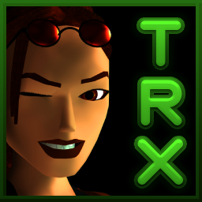
  </a>

Welcome to **TRX** – an open-source reimplementation of **Tomb Raider 1**,
**Tomb Raider 2** and **Tomb Raider 3**. TRX aims to enhance these classic
games through decompilation and the implementation of open-source alternatives
to proprietary components. TRX is a single engine capable of running TR1, TR2,
TR3, and custom levels respecting each of the distinct, classic engines'
mechanics.

## Showcase
<table>
    <tr>
        <th>
            Restored braid in TR1
            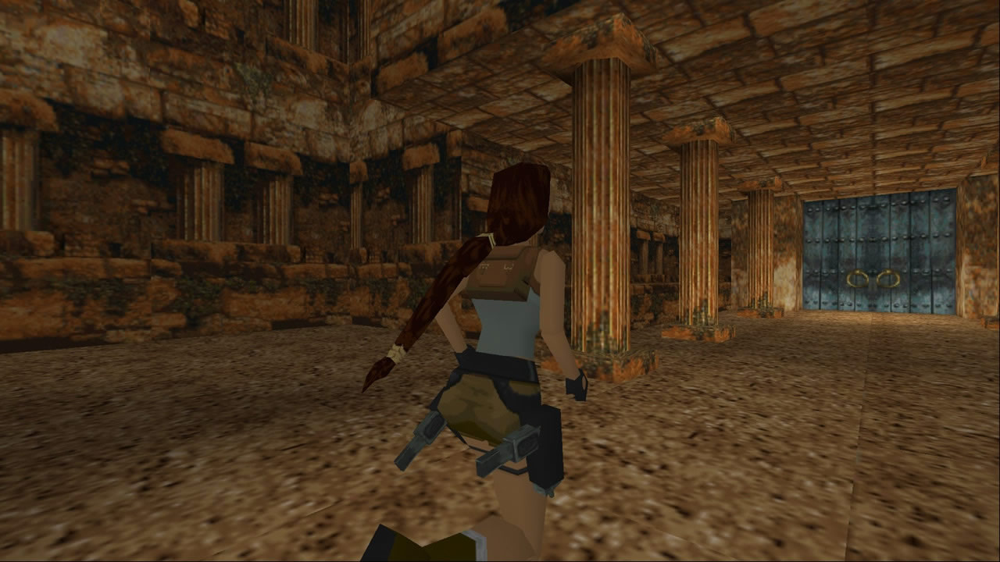
        </th>
        <th>
            Enemy health bar and UI scaling
            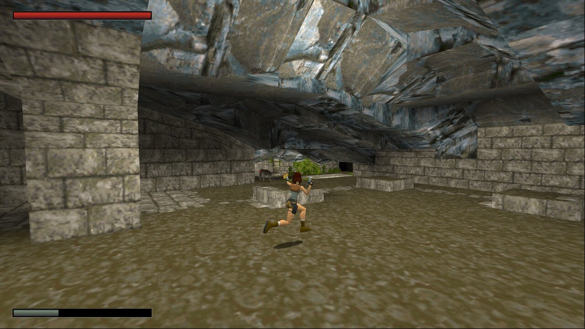
        </th>
    </tr>
    <tr>
        <th>
            Photo mode
            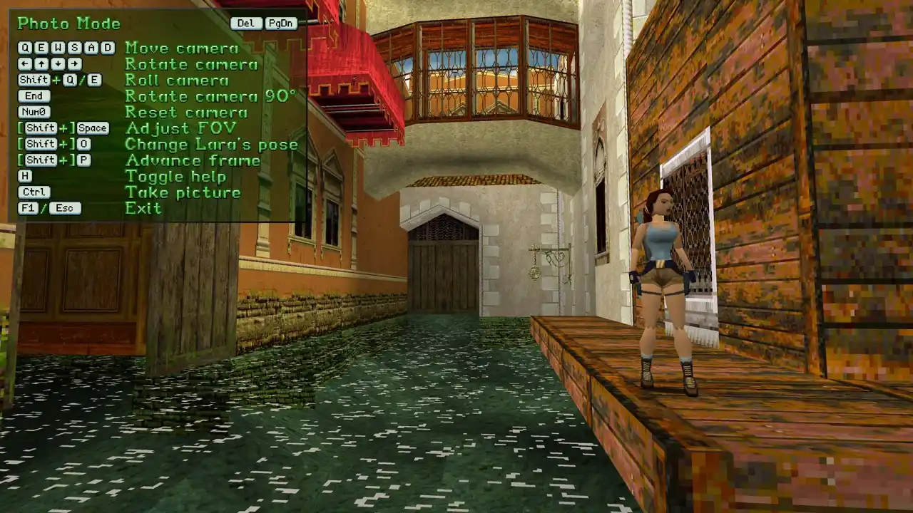
        </th>
        <th>
            3D pickups
            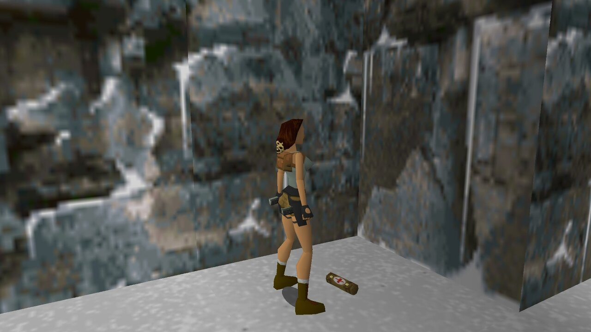
        </th>
    </tr>
    <tr>
        <th>
            Skybox support
            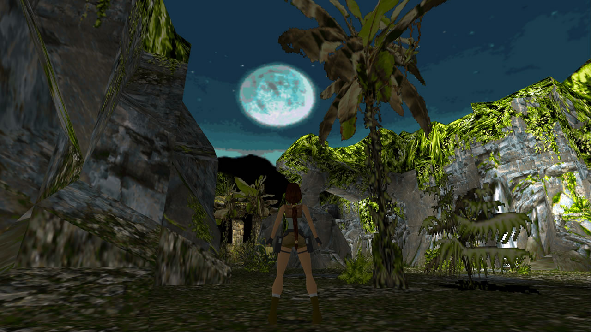
        </th>
        <th>
            Updated moveset including sprint
            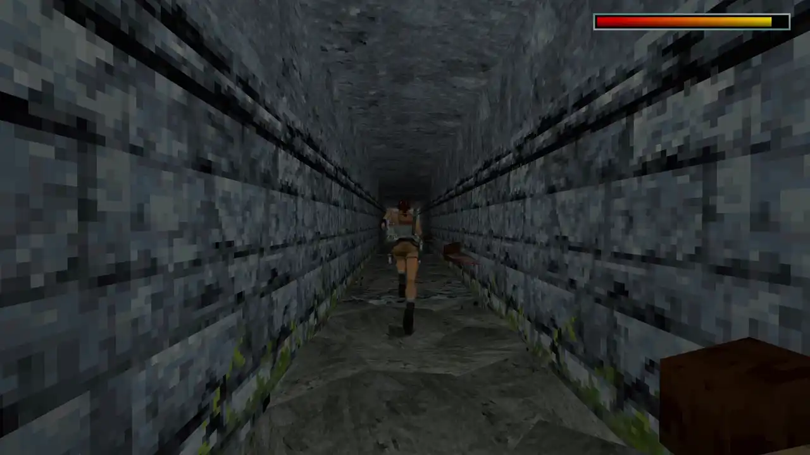
        </th>
    </tr>
    <tr>
        <th>
            Customizable draw distance
            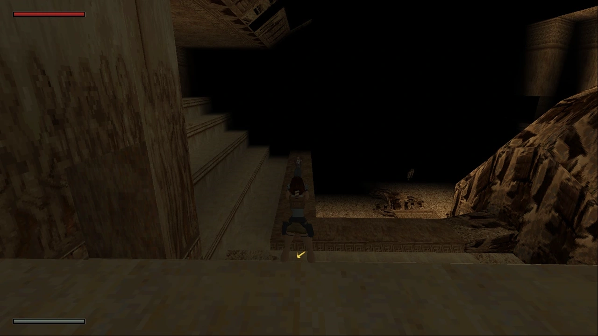
        </th>
        <th>
            Developer console
            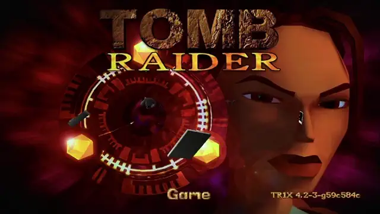
        </th>
    </tr>
    <tr>
        <th>
            Detailed level stats
            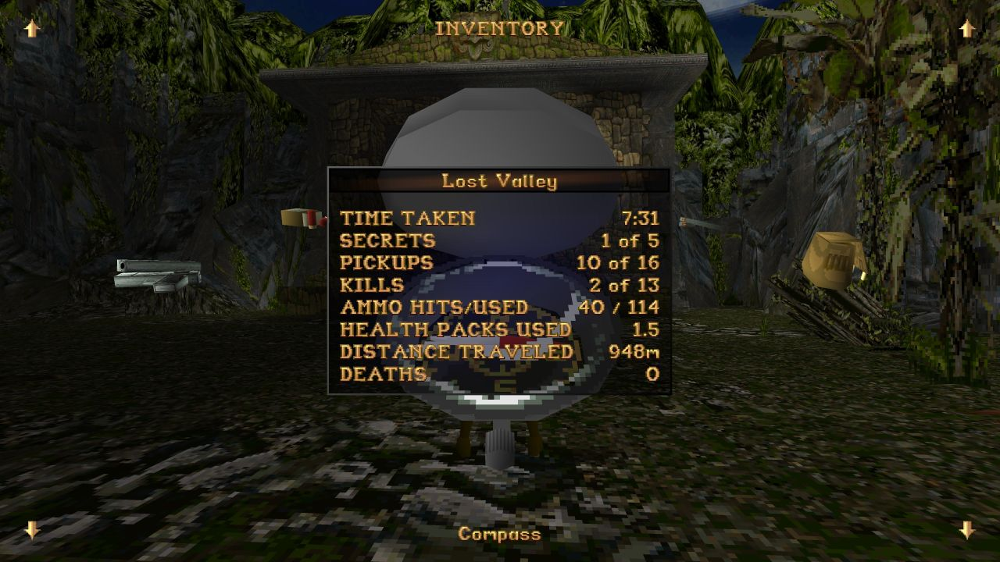
        </th>
        <th>
            PS1 UI and expanded options
            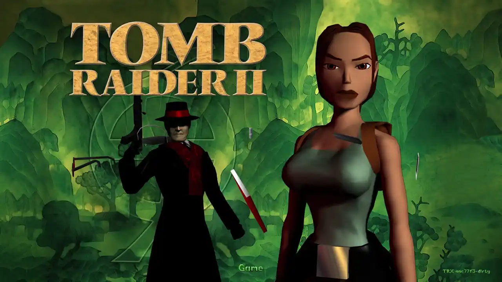
        </th>
    </tr>
</table>

## Download

Download the latest TRX release:

### Installation instructions

Please refer to [this document](docs/trx/INSTALLING.md).

### Changelog

Please refer to [this document](docs/CHANGELOG.md).

## Q&A

1. **Are all three games fully playable from beginning to end?**

    Yes! If you encounter a bug, please file a ticket.

2. **Can we get HD textures? What about other visual updates?**

    Regarding HD texture packs, that feature is not currently planned.

    As for other visual updates, being able to introduce reflections and
    skyboxes shows that quite literally the sky is the limit. TRX is constantly
    getting new rendering improvements and texture fixes. But great stuff
    takes time.

3. **Can I play this on Mac, Linux, Android...?**

    Currently supported platforms include Windows, Linux and macOS.

4. **Can I play this with a controller?**

    TRX supports a wide variety of controllers out of the box with no
    additional software required. The keyboard or controller controls
    can be fully customized in the Controls menu with multiple layouts.
    Multi-key combo shortcuts (up to 3 keys) and two binding slots per
    action are also supported.

5. **What about TR4 support?**

    TR4 work is well underway! Still early, but we're moving _fast_. Keep track
    of progress by checking out the [changelog](docs/CHANGELOG.md) and
    [release showcases](https://www.youtube.com/@lostartefacts). Please note
    that tickets for problems specific to TR4 raised before the game is fully
    supported will most likely be closed.

## Website
The Lost Artefacts team is a small, passionate community of developers and
creators with a deep love for the classic Tomb Raider titles. Our team builds
and maintains freeware fan projects that celebrate Lara Croft's iconic
adventures. Visit the website by clicking the logo below for more information
on TRX and its documentation as well as other Tomb Raider projects.

  <a href="https://lostartefacts.dev/">
    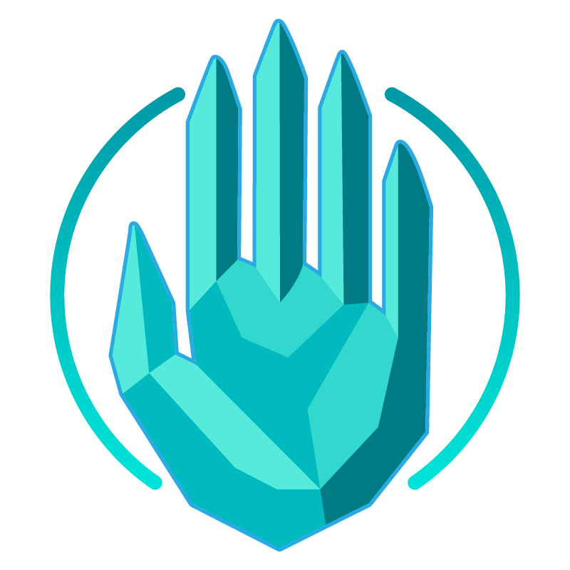
  </a>

## Credits

- Endless GitHub contributors.
- TR1 title screen image by Kidd Bowyer. HD assets by goblan and posix.
- TR2 HD images by Arsunt.
